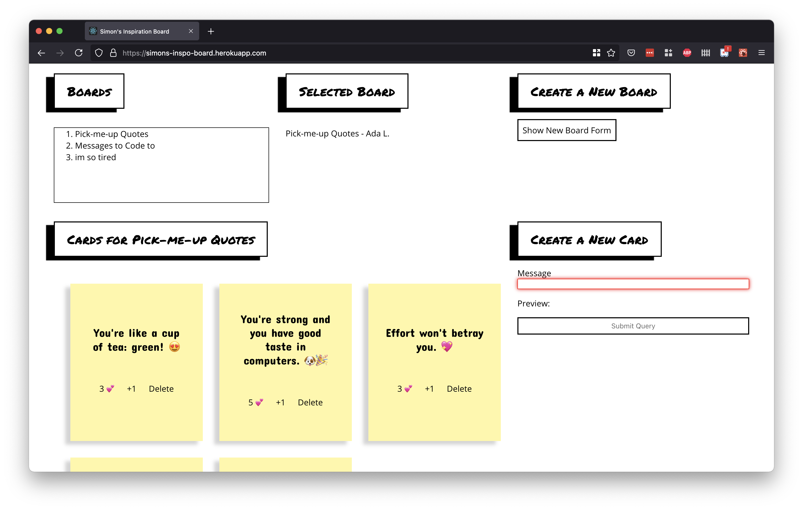

# Full-Stack Inspiration Board: Back-end Layer

## Goal
Our goal is to create a digital inspiration board.

Users should be able to create one or more boards.

Then, a user can select a single board. When a user selects a board, they can see all the cards associated with that board.

Users can even "+1" the cards that they agree with!

### Demo

[An example implementation of the project is deployed on Heroku](https://team-euphoria-front-end.herokuapp.com/). 

 
_Fig. This example displays a list of boards, the name of a selected board (if there is one), and a form to create a new board._

  
_Fig. This example displays all cards that belong to a board, once a selected board has been chosen._

  
_Fig. This example has a section of cards. Each card has a message, the number of "likes," a button to add the like, and a button to delete the card._

## Back-end Layer Requirements

Back-end layer include:

- Flask
- PostgreSQL
- SQLAlchemy (including Migrate and Alembic)
- venv
- python-dotenv
- gunicorn
- pytest
- flask_cors

### Create & Read Boards

**A user is be able to...**

#### Create

- Create a new board, by filling out a form. The form includes "title" and "owner" name of the board.
- See an error message if a new board with an empty/blank/invalid/missing "title" or "owner" input is being created.
- Hide the "New Board" form, so the "New Board" form  is not seen all the time when looking at cards.

#### Read

- View a list of all boards.
- Select a board.

### Create, Read, and Delete Cards

**A user is be able to...**

#### Create

- Create a new card _for the selected board_, by filling out a form and filling out a "message."
- See an error message  the card's "message" is  more than 40 characters.
- See an error message if a user tries to make a new card with an empty/blank/invalid/missing "message."

#### Read

- View a list of cards that belong to the selected board.

#### Delete

- Delete an existing card.

### +1 Feature

**A user, can be able to...**

- Press a "+1" icon on a single card, to indicate that an agreement with it.
- See the number of "+1"s on a single card. Every card starts with zero "+1"s.

### Deployment

The back-end API was deployed on Heroku.
